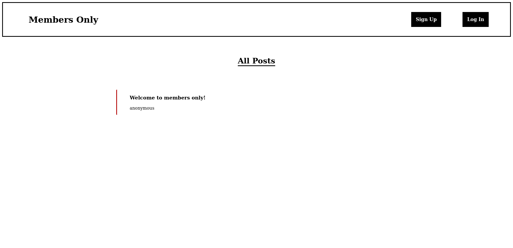
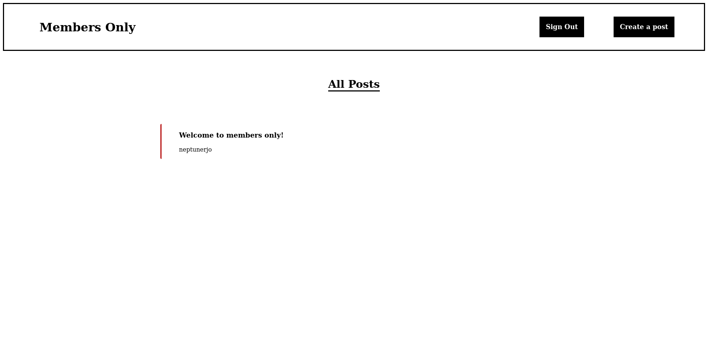

## Members Only

Members-only is a anonymous blogsite that utilizes NodeJS.
This project is meant to expand my skills with Node, authentication, and MongoDB.

Users can view anonymous posts created by members.
Signed in users are able to see the authors of posts and are able to create posts of their own.
Members are also able to delete their posts.

Visit Members-Only [here](https://members-only-neptunerjo.herokuapp.com/dashboard)

## Table of contents

- [Screenshots](#screenshots)
- [Technology](#technology)
- [Setup](#setup)

## Screenshots

## Technology

Built with:
`NodeJs`, `MongoDB`, `EJS`, `Passport`, `Express`, and `bcryptjs`.

## Setup

- Download or clone the repository
- Run `npm install`
- Run `npm start`, `node app`, or if you have [Nodemon](https://www.npmjs.com/package/nodemon) installed: `nodemon app`.
- Visit the app at localhost:3000
